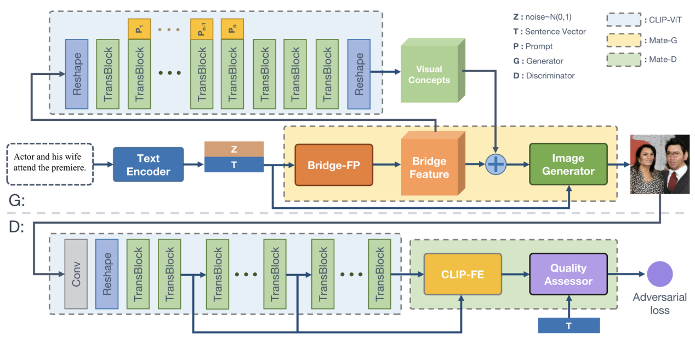

# GALIP: Generative Adversarial CLIPs for Text-to-Image Synthesis (CVPR 2023)

# A high-quality, fast, and efficient text-to-image model

Official Pytorch implementation for our paper [GALIP: Generative Adversarial CLIPs for Text-to-Image Synthesis](https://arxiv.org/abs/2301.12959) by [Ming Tao](https://scholar.google.com/citations?user=5GlOlNUAAAAJ), [Bing-Kun Bao](https://scholar.google.com/citations?user=lDppvmoAAAAJ&hl=en), [Hao Tang](https://scholar.google.com/citations?user=9zJkeEMAAAAJ&hl=en), [Changsheng Xu](https://scholar.google.com/citations?user=hI9NRDkAAAAJ). 

    

Details can be found in https://github.com/tobran/GALIP
